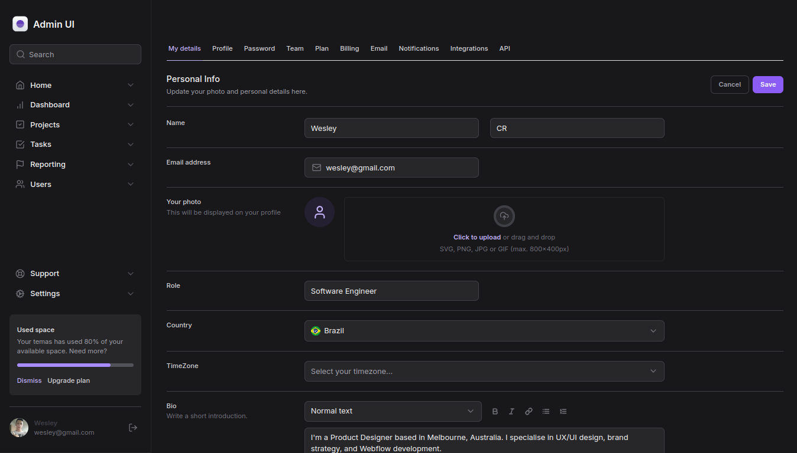

<h1 align="center"> <strong>Admin UI</strong></h1>

<p align="center">


</p>
<h1 align="center"  justify-content="space-between">
 
</h1>

# 📕 About
Creating a dashboard visual.
</br>

# 🛠️Technologies:
This project was made using the following technologies:
 - React JS
 - Next
 - TypeScript
 - Tailwind
 - Tailwind Variants

## Getting Started

First, run the development server:

```bash
npm run dev
# or
yarn dev
# or
pnpm dev
# or
bun dev
```

Made with ❤️ by [Wesley Rodrigues](https://github.com/wesleywcr)🤙👊
